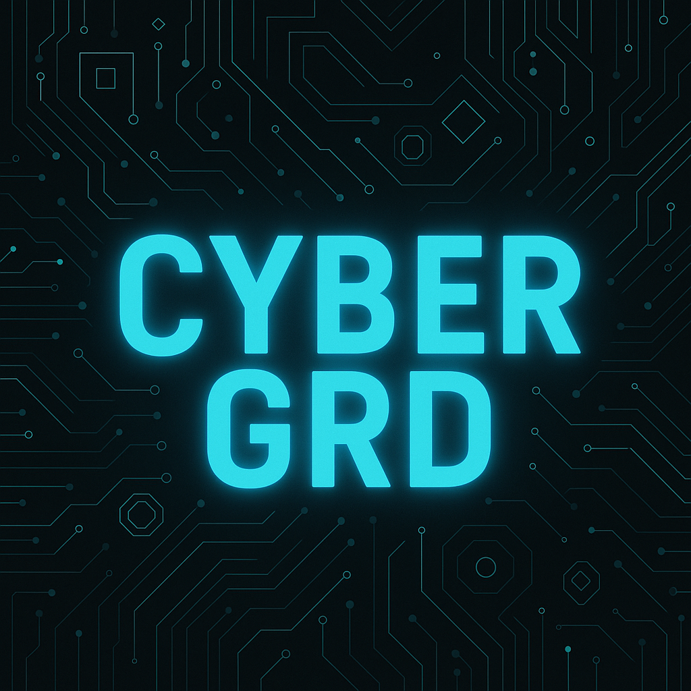

  

  
  
  
  

  

# 📘 Livre de Cybersécurité – GRD78

Bienvenue dans mon **grimoire personnel de cybersécurité**, un projet de cœur construit étape par étape, à la fois pour l’apprentissage et le partage.  
Ce dépôt regroupe tout ce que j’ai appris et appliqué en Blue Team, Red Team, scripts, scénarios réels, outils, et environnements professionnels.  
Il accompagnera également ma montée en compétences à l'**École 2600 (2025–2028)** 🧠💻

---

## 📚 Sommaire

- [🔰 Introduction à la cybersécurité](#-introduction-à-la-cybersécurité)
- [🛡️ Blue Team (Défense)](#️-blue-team-défense)
- [⚔️ Red Team (Attaque)](#️-red-team-attaque)
- [🛠️ Outils & Scripts](#️-outils--scripts)
- [🧪 Scénarios pratiques](#-scénarios-pratiques)
- [🧩 Environnements & bonnes pratiques](#-environnements--bonnes-pratiques)
- [📄 Fichiers disponibles](#-fichiers-disponibles)
- [🤝 Contribuer / Contact](#-contribuer--contact)

---

## 🔰 Introduction à la cybersécurité

Définitions, enjeux, objectifs CIA, vocabulaire clé, familles d’attaques et acteurs du cyberespace.

## 🛡️ Blue Team (Défense)

Surveillance réseau avec Wireshark, scans avec Nmap, logs Apache, UFW, Fail2Ban, logwatch, durcissement PHP, forensic, etc.

## ⚔️ Red Team (Attaque)

Reconnaissance (Gobuster, Nikto), vulnérabilités DVWA (XSS, LFI, File Upload), Reverse Shell, Escalade de privilèges, bruteforce Hydra, exploitation mobile (Android/iOS).

## 🛠️ Outils & Scripts

Netcat, Metasploit, Burp Suite, Termux, Python, Bash, PowerShell.  
Exemples de reverse shell, scanner de ports, automatisations.

## 🧪 Scénarios pratiques

Études de cas réels : interception HTTP, exploitation DVWA, défense active, bruteforce, reverse shell et faille SUID.

## 🧩 Environnements & bonnes pratiques

VM Kali, Ubuntu, proxies, Tor, gestion de mots de passe, Obsidian, GitHub, documentation en Markdown et PDF.

---

## 📄 Fichiers disponibles

- [`Livre_Cybersecurite.md`](./Livre_Cybersecurite.md) – version Markdown complète
- [`pdf/Livre_Cybersecurite.pdf`](./pdf/Livre_Cybersecurite.pdf) – version PDF à imprimer ou lire offline
- Dossiers `scripts/`, `images/`, `pdf/` : à enrichir au fil du temps !

---

## 🤝 Contribuer / Contact

Tu es passionné(e) aussi ? Viens échanger ou contribuer !  
**Auteur :** GRD  
📧 [Contact pro](mailto:tonmail@pro.com)  
🌐 [GitHub](https://github.com/GRD78)

---

> 🔐 *Ce projet est personnel, pédagogique et évolutif. Toute contribution bienveillante est la bienvenue !*
