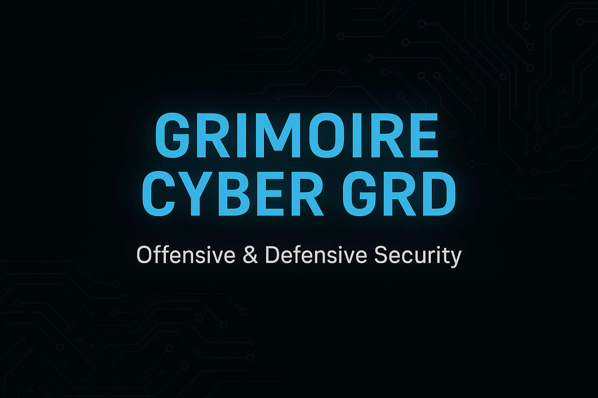

  

<link rel="icon" type="image/png" href="./favicon.ico">

# 📘 Bienvenue sur mon Livre de Cybersécurité GRD78

Bienvenue dans la version en ligne de mon grimoire personnel.  
Je partage ici tout mon apprentissage en cybersécurité offensive et défensive.

---

## 🧭 Navigation rapide

| 📂 Pages | 📌 Description |
|---------|----------------|
| [📖 Livre complet (Markdown)](./Livre_Cybersecurite.md) | Le contenu central de tout le projet |
| [⬇️ Télécharger le PDF](./pdf/Livre_Cybersecurite.pdf) | Livre complet en version offline |
| [🧠 Roadmap](./roadmap.md) | Suivi de ma progression cyber |
| [🛠️ Outils](./tools.md) | Liste de tous les outils utilisés |
| [🎯 Scénarios & CTF](./challenges.md) | Mes exercices, défis, et scénarios DVWA |
| [📬 Contact Pro](./contact.md) | Mon LinkedIn, e-mail et informations professionnelles |

---

## 💡 Objectifs du projet

- Regrouper tous mes cours et pratiques cyber en un seul endroit
- Créer un support pédagogique ouvert à tous
- Valoriser mon parcours à l’école 2600 (2025–2028)
- Inspirer d'autres passionnés à documenter leur savoir

---

## 👨🏾‍💻 Auteur : GRD

🎓 Étudiant en cybersécurité (École 2600)  
🧰 Hacker éthique passionné (Red & Blue Team)  
📬 Contact : [Mamadou.konate@ecole2600.com](mailto:Mamadou.konate@ecole2600.com)

---

  🛡️ Ce site est maintenu par <strong>GRD</strong> • 🇫🇷 • Dernière mise à jour : 2025  
   
  🔗 <a href="https://github.com/GRD78/cyberbook-grd">Voir sur GitHub</a> |
  <a href="./contact.md">Contact pro</a> |
  <a href="./roadmap.md">Ma progression</a>

> 🛡️ Site mis à jour régulièrement avec de nouveaux outils, exercices, scripts et savoirs cyber.
